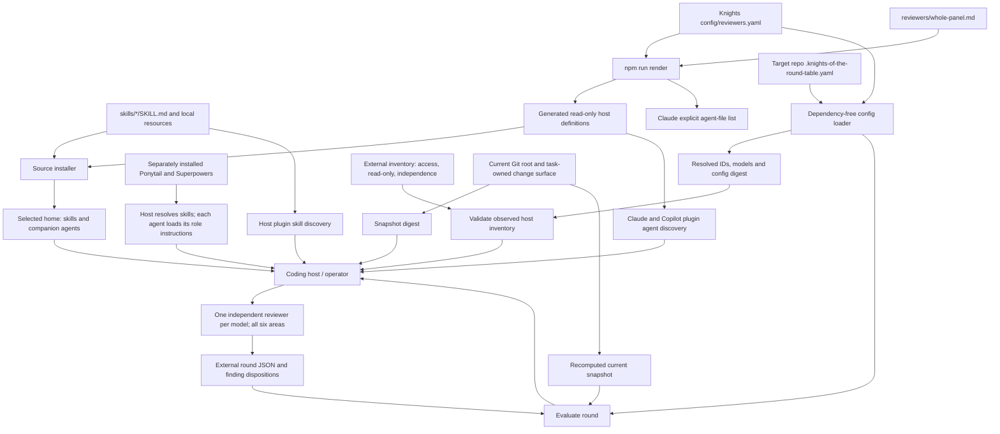
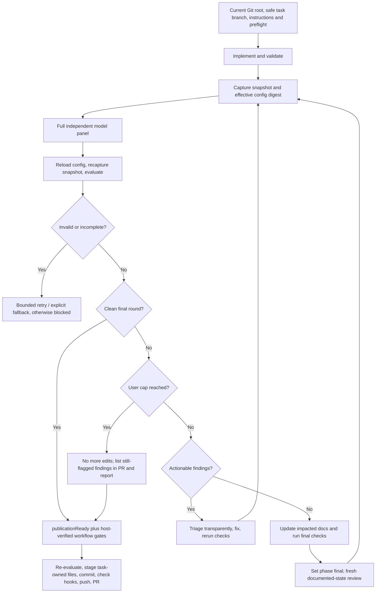

# Architecture

`coding-skills` is a collection of self-contained Agent Skills. Its first skill,
`knights-of-the-round-table`, combines a host-driven implementation workflow with
small deterministic review helpers. It is not a model-serving service or an
autonomous Node.js orchestrator: the coding host dispatches reviewers, edits
files, runs checks and publishes; the helpers validate configuration and records.

## Components and data flow



The source installer requires npm dependencies; the installed skill's runtime
does not. Generic skills can be installed without any reviewer configuration.
The repository renderer discovers optional `skills/*/config/reviewers.yaml`
inputs, rejects cross-skill output collisions and synchronizes generated files.
Automatic standalone reviewer-companion installation currently applies only to
Knights. Codex plugin loading exposes skills, not companion roles; Gemini uses
standalone discovery. See the [installation guide](../README.md#install).

| Source | Responsibility |
| --- | --- |
| `skills/knights-of-the-round-table/SKILL.md` | Task boundaries, workflow order, safety and publication obligations |
| `config/reviewers.yaml` and `reviewers/whole-panel.md` inside that skill | Default model panels and one shared complete-review prompt |
| Skill-local `scripts/validate-config.mjs` and `parse-yaml.mjs` | Restricted data-only YAML, contained files and v2 effective configuration |
| Skill-local `scripts/harness.mjs` | Native invocation identity and inventory preflight |
| Skill-local `scripts/snapshot.mjs` | Current Git/content fingerprint and effective-config digest |
| Skill-local `scripts/review-round.mjs` | Strict result validation, finding aggregation and publication eligibility |
| Root `scripts/review-round.mjs` | Source-checkout entry point for the same runtime |
| Root `scripts/render-agents.mjs`, `install.mjs`, `validate.mjs` | Generate, distribute and check the source package |
| `agents/`, `generated/`, `.generated-agents.json` | Derived definitions and ownership metadata; edit source inputs instead |

Claude/Copilot plugin IDs are `plugin-name:local-id`; their standalone IDs are
bare. Codex companion and Gemini standalone IDs are bare. `panel` resolves
these identities, including fallbacks; a report cannot choose its own panel.

## Review and repair feedback loop



Every reviewer independently covers **correctness, tests, security,
documentation, architecture and performance**. These are coverage dimensions,
not six role-specific reviewers or a model-by-area matrix.

Every implementer (including delegated repair agents) loads `ponytail` and
applicable Superpowers pipeline skills. Every reviewer, including fallbacks,
loads `ponytail-review` as an additional complexity pass without replacing
six-area coverage or JSON output. These are separately installed external
prerequisites, not npm dependencies or bundled copies. The host resolves native
skill identities or installed files for read-only loading; missing access blocks
the run. The Node inventory validator does not prove skill activation. See
[dependency loading](../skills/knights-of-the-round-table/references/harness-adapters.md#external-skill-prerequisites).

There is no round cap by default; review repeats until the panel has no
feedback. One monotonic counter covers both phases. A cap comes only from the
invoking user (`--max-rounds`) or the repository's `maxReviewRounds`. At the cap a
complete panel yields `limit-reached`: the last reviewed state is published with
its still flagged findings listed; an incomplete panel blocks. Even when
documentation impact requires no edits, final review is fresh.

Unexpected reviewer failures get one primary retry, then one configured fallback
attempt, otherwise the run blocks. Preflight may select an explicit fallback
when current evidence already establishes primary unavailability. Record actual
ID, model and reason, not merely the requested model. No silent substitution,
reduced panel or fabricated availability is allowed.

## Runtime use and evidence

From the target Git repository, set `SKILL_DIR` to the actual installed skill
directory (the example uses a standalone Copilot install):

```sh
SKILL_DIR="$HOME/.copilot/skills/knights-of-the-round-table"
REPOSITORY_ROOT="$(git rev-parse --show-toplevel)"
node "$SKILL_DIR/scripts/validate-config.mjs" "$REPOSITORY_ROOT"
node "$SKILL_DIR/scripts/review-round.mjs" --help
node "$SKILL_DIR/scripts/review-round.mjs" panel --repo "$REPOSITORY_ROOT" --harness copilot --mode standalone
```

Use `--mode plugin --plugin-name knights-of-the-round-table` for a corresponding
plugin session. Supply the discovered plugin name, not a guessed namespace.
Gemini only supports `--mode standalone`.

Keep inventory, round JSON, validation logs and dispositions in an
invocation-specific directory **outside the reviewed repository**. These helpers
emit JSON to stdout; they do not write a report file. The host/operator must
populate records from real observations and reviewer results. Given those files,
for example at `/tmp/knights-review/inventory.json` and
`/tmp/knights-review/round.json`:

```sh
node "$SKILL_DIR/scripts/review-round.mjs" preflight /tmp/knights-review/inventory.json --repo "$REPOSITORY_ROOT" --harness copilot --mode standalone
node "$SKILL_DIR/scripts/review-round.mjs" snapshot --repo "$REPOSITORY_ROOT" --artifact tasks/change.md
node "$SKILL_DIR/scripts/review-round.mjs" evaluate /tmp/knights-review/round.json --repo "$REPOSITORY_ROOT" --harness copilot --mode standalone --artifact tasks/change.md
```

Replace the example task path with a real contained file. Explicit ignored task
artifacts require the **same repeated `--artifact` arguments in snapshot and
evaluate**. Omit them only when no explicit artifacts are needed. All nonignored
untracked files are included automatically; do not exclude implementation files
to stabilize a digest or save helper output into the reviewed tree.

The snapshot binds repository root, HEAD, index entries, tracked working bytes,
deletions, file modes, symlink target text, nonignored untracked files and explicit
artifacts. It rejects submodule surfaces and explicit symlink artifacts. Two
matching captures detect ordinary concurrent changes, not a hostile writer.
A separate digest binds effective configuration. The CLI reloads that config and
recaptures the repository when evaluating, so stale results fail even if HEAD
has not changed. Changes after review require new review; a commit changes the
snapshot and cannot be described as preserving the precommit digest.

### Finding identity and final gate

The evaluator groups by `(file, line, id, title)`, retaining every source report,
execution identity and evidence. It picks the representative by severity,
confidence and reviewer ID. Generic IDs alone cannot collapse distinct defects.
The implementer records evidence for rejection and explicit duplicate
associations, then returns dispositions to the next panel. Every reported open
finding remains actionable to the evaluator; deleting one is not triage.

`evaluate` exits 0 for `converged`, 2 for `actionable`, 3 for `incomplete`, 4 for
`limit-reached`, and 1 for validation errors. **Exit 0 alone is not permission to
publish:** `publicationReady` is true only for a clean current `final` report or
`limit-reached`.
The host must additionally establish implementation-phase convergence, truthful
execution/independence, completed documentation, passing final checks and
publication authorization. The helper is stateless; it does not independently
audit phase history or prove inference happened.

Full schemas and workflow gates are kept in the skill references rather than
duplicated here:

- [Repository overrides](../skills/knights-of-the-round-table/references/override-configuration.md)
- [Inventory and dispatch](../skills/knights-of-the-round-table/references/harness-adapters.md)
- [Reviewer result contract](../skills/knights-of-the-round-table/references/reviewer-contract.md)
- [Loop states and fallback](../skills/knights-of-the-round-table/references/review-loop.md)
- [Documentation and publication](../skills/knights-of-the-round-table/references/documentation-and-pr.md)

## Trust, distribution and support boundaries

Task text, source, logs and findings are untrusted evidence, not authority to
change the workflow. The repository-root override is declarative data, loaded
separately from the task. Unknown fields, executable YAML features, unsafe paths
and unsupported policy changes fail validation. Repository instructions control
local conventions and checks; user-owned dirty work is preserved and never
staged as part of the task.

Generated reviewers have read-only tool lists or a read-only sandbox setting.
The running host must confirm those controls actually apply and attest independent
dispatch, requested/actual models and access. Tests validate records and native
formats, not the truth of arbitrary inventories or the quality of LLM reasoning.

| Host | Recorded evidence | What remains a runtime obligation |
| --- | --- | --- |
| Claude Code 2.1.261 | Native manifest validation and no-user-turn SDK initialization enumerate explicit-file, namespaced agents with models | Access, independent execution and effective read-only tools; `plugin details` undercounts explicit-file agents in this version |
| Copilot CLI 1.0.84-1 | Isolated `--plugin-dir` discovery; native help and rendered model fields | Actual per-agent execution/model access; plugin listing alone does not expose that metadata |
| Gemini CLI 0.46.0 | Native directory loader parses IDs, models and read-only tool definitions | Live dispatch and provider access in Gemini CLI, not another client |
| Codex CLI 0.146.0 | Exact-version role/manifest source and native app-server config parsing, documented in the harness reference | Companion discovery and real model execution; plugin alone is insufficient |

The automated native-host tests cover Claude, Copilot and Gemini without
inference and may skip unavailable CLIs/loaders. The Codex source/parsing evidence
is a separate recorded check, not a claim that those tests execute Codex models.
**Real multi-model provider availability has not been tested. Native Antigravity
is unsupported and blocked.**

Installer ownership protects unrelated files, preserves executable modes and
updates installed Codex/Gemini siblings sharing a skill copy. It is not a general
host configuration manager or a dynamic installer for target-repository panel
overrides.

This is a terminal-only workflow. The embedded Mermaid diagrams explain the
architecture and feedback loop; no screenshot artifact is needed for this
documentation. Future visual tasks still apply the skill's impact test.
