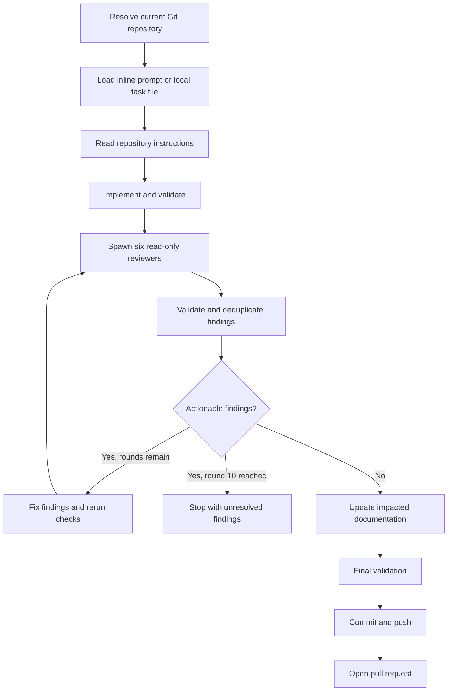

# Knights of the Round Table Implementation Plan

> **For agentic workers:** REQUIRED SUB-SKILL: Use superpowers:subagent-driven-development (recommended) or superpowers:executing-plans to implement this plan task-by-task. Steps use checkbox (`- [ ]`) syntax for tracking.

**Goal:** Build a portable `knights-of-the-round-table` skill that implements a task in the current repository, runs a configurable multi-agent review-and-fix loop, updates impacted documentation, and automatically opens a pull request after convergence.

**Architecture:** Keep the workflow, reviewer roles, schemas, and prompts canonical under `skills/knights-of-the-round-table/`. Generate thin Claude, Copilot, Codex, and Gemini agent definitions from shared reviewer prompts, and provide an installer that places the skill and generated agents in each harness's supported user directories. Use dependency-light Node.js scripts and built-in tests to validate configuration, render adapters, evaluate review-round convergence, and test installation without calling live model or GitHub services.

**Tech Stack:** Agent Skills `SKILL.md`, Markdown, YAML, Node.js ESM, Node built-in test runner, `yaml`, Git, Mermaid.

---

## File Structure

```text
.
├── .claude-plugin/
│   └── plugin.json
├── .codex-plugin/
│   └── plugin.json
├── .github/
│   └── plugin/
│       └── marketplace.json
├── .agents/
│   └── plugins/
│       └── marketplace.json
├── agents/
│   ├── architecture-reviewer.agent.md
│   ├── correctness-reviewer.agent.md
│   ├── documentation-reviewer.agent.md
│   ├── performance-reviewer.agent.md
│   ├── security-reviewer.agent.md
│   └── tests-reviewer.agent.md
├── generated/
│   ├── claude/agents/*.md
│   ├── codex/agents/*.toml
│   └── gemini/agents/*.md
├── skills/
│   └── knights-of-the-round-table/
│       ├── SKILL.md
│       ├── assets/pr-body-template.md
│       ├── config/reviewers.yaml
│       ├── references/
│       │   ├── documentation-and-pr.md
│       │   ├── harness-adapters.md
│       │   ├── review-loop.md
│       │   └── reviewer-contract.md
│       └── reviewers/
│           ├── architecture.md
│           ├── correctness.md
│           ├── documentation.md
│           ├── performance.md
│           ├── security.md
│           └── tests.md
├── scripts/
│   ├── install.mjs
│   ├── render-agents.mjs
│   ├── review-round.mjs
│   └── validate.mjs
├── tests/
│   ├── fixtures/review-rounds/*.json
│   ├── frontmatter.mjs
│   ├── install.test.mjs
│   ├── package.test.mjs
│   ├── render-agents.test.mjs
│   ├── review-round.test.mjs
│   ├── skill-contract.test.mjs
│   └── validate-config.test.mjs
├── LICENSE
├── README.md
├── VERSION
├── package-lock.json
└── package.json
```

The root `agents/*.agent.md` files are the Copilot plugin agents. Claude, Codex, and
Gemini variants are generated because their manifest fields and file locations differ.
All variants embed prompts from the six canonical files under the skill's `reviewers/`
directory.

### Task 1: Establish the package and test foundation

**Files:**
- Create: `package.json`
- Create: `VERSION`
- Create: `LICENSE`
- Create: `tests/frontmatter.mjs`
- Test: `tests/package.test.mjs`

- [ ] **Step 1: Write the failing package contract test**

Create `tests/package.test.mjs`:

```js
import assert from "node:assert/strict";
import { readFileSync } from "node:fs";
import test from "node:test";

test("package declares the required scripts and skill metadata", () => {
  const packageJson = JSON.parse(
    readFileSync(new URL("../package.json", import.meta.url), "utf8"),
  );
  assert.equal(packageJson.type, "module");
  assert.equal(packageJson.scripts.test, "node --test tests/*.test.mjs");
  assert.equal(packageJson.scripts.validate, "node scripts/validate.mjs");
  assert.equal(packageJson.scripts.render, "node scripts/render-agents.mjs");
});
```

- [ ] **Step 2: Run the test to verify it fails**

Run: `npm test`

Expected: FAIL because `package.json` does not exist.

- [ ] **Step 3: Add the package metadata and frontmatter parser**

Create `package.json`:

```json
{
  "name": "knights-of-the-round-table",
  "version": "0.1.0",
  "private": true,
  "type": "module",
  "description": "Cross-harness implementation, review, documentation, and pull request skill",
  "license": "MIT",
  "scripts": {
    "test": "node --test tests/*.test.mjs",
    "validate": "node scripts/validate.mjs",
    "render": "node scripts/render-agents.mjs",
    "check": "npm run render -- --check && npm run validate && npm test"
  },
  "dependencies": {
    "yaml": "^2.8.1"
  }
}
```

Create `VERSION`:

```text
0.1.0
```

Create `tests/frontmatter.mjs`:

```js
import YAML from "yaml";

export function parseFrontmatter(text, source = "document") {
  const normalized = text.replace(/\r\n/g, "\n");
  const match = /^---\n([\s\S]*?)\n---(?:\n|$)/.exec(normalized);
  if (!match) {
    throw new Error(`${source}: missing YAML frontmatter`);
  }

  const value = YAML.parse(match[1]);
  if (!value || typeof value !== "object" || Array.isArray(value)) {
    throw new Error(`${source}: frontmatter must be a mapping`);
  }
  return value;
}
```

Add the standard MIT license text to `LICENSE`.

- [ ] **Step 4: Install the declared dependency**

Run: `npm install`

Expected: `package-lock.json` is created and installation exits 0.

- [ ] **Step 5: Run the test and confirm the remaining expected failure**

Run: `npm test`

Expected: the package test passes.

- [ ] **Step 6: Commit**

```bash
git add package.json package-lock.json VERSION LICENSE tests
git commit -m "chore: establish skill package"
```

### Task 2: Define and validate reviewer configuration

**Files:**
- Create: `skills/knights-of-the-round-table/config/reviewers.yaml`
- Create: `scripts/validate.mjs`
- Test: `tests/validate-config.test.mjs`

- [ ] **Step 1: Write failing configuration tests**

Create `tests/validate-config.test.mjs`:

```js
import assert from "node:assert/strict";
import { readFileSync } from "node:fs";
import test from "node:test";
import YAML from "yaml";

import { validateConfig } from "../scripts/validate.mjs";

const configPath = new URL(
  "../skills/knights-of-the-round-table/config/reviewers.yaml",
  import.meta.url,
);

test("default configuration enables the six approved reviewer roles", () => {
  const config = YAML.parse(readFileSync(configPath, "utf8"));
  assert.deepEqual(
    config.reviewers.map(({ role }) => role),
    [
      "correctness",
      "tests",
      "security",
      "documentation",
      "architecture",
      "performance",
    ],
  );
  assert.equal(config.maxReviewRounds, 10);
  assert.deepEqual(validateConfig(config), []);
});

test("configuration rejects duplicate roles and circular fallbacks", () => {
  const errors = validateConfig({
    version: 1,
    maxReviewRounds: 10,
    reviewers: [
      { role: "tests", fallbackRole: "security", harnesses: {} },
      { role: "tests", fallbackRole: "tests", harnesses: {} },
    ],
  });
  assert.ok(errors.some((error) => error.includes("duplicate reviewer role")));
  assert.ok(errors.some((error) => error.includes("fallback cycle")));
});
```

- [ ] **Step 2: Run the tests to verify they fail**

Run: `node --test tests/validate-config.test.mjs`

Expected: FAIL because the configuration and validator do not exist.

- [ ] **Step 3: Add the canonical reviewer configuration**

Create `skills/knights-of-the-round-table/config/reviewers.yaml`:

```yaml
version: 1
maxReviewRounds: 10
reviewerRetryCount: 1
documentationPolicy: impact-based
taskSources:
  - inline-prompt
  - local-file
reviewers:
  - role: correctness
    prompt: reviewers/correctness.md
    fallbackRole: architecture
    harnesses:
      claude: correctness-reviewer
      copilot: correctness-reviewer
      codex: correctness-reviewer
      gemini: correctness-reviewer
  - role: tests
    prompt: reviewers/tests.md
    fallbackRole: correctness
    harnesses:
      claude: tests-reviewer
      copilot: tests-reviewer
      codex: tests-reviewer
      gemini: tests-reviewer
  - role: security
    prompt: reviewers/security.md
    fallbackRole: correctness
    harnesses:
      claude: security-reviewer
      copilot: security-reviewer
      codex: security-reviewer
      gemini: security-reviewer
  - role: documentation
    prompt: reviewers/documentation.md
    fallbackRole: correctness
    harnesses:
      claude: documentation-reviewer
      copilot: documentation-reviewer
      codex: documentation-reviewer
      gemini: documentation-reviewer
  - role: architecture
    prompt: reviewers/architecture.md
    fallbackRole: correctness
    harnesses:
      claude: architecture-reviewer
      copilot: architecture-reviewer
      codex: architecture-reviewer
      gemini: architecture-reviewer
  - role: performance
    prompt: reviewers/performance.md
    fallbackRole: architecture
    harnesses:
      claude: performance-reviewer
      copilot: performance-reviewer
      codex: performance-reviewer
      gemini: performance-reviewer
```

- [ ] **Step 4: Implement strict configuration validation**

Create `scripts/validate.mjs` with exported `validateConfig(config)` and CLI behavior.
The function must return an array of errors and enforce:

```js
const ALLOWED_TOP_LEVEL = new Set([
  "version",
  "maxReviewRounds",
  "reviewerRetryCount",
  "documentationPolicy",
  "taskSources",
  "reviewers",
]);
const HARNESSES = ["claude", "copilot", "codex", "gemini"];
const TASK_SOURCES = new Set(["inline-prompt", "local-file"]);
```

Implement checks for:

```js
if (config.version !== 1) errors.push("version must be 1");
if (!Number.isInteger(config.maxReviewRounds) || config.maxReviewRounds < 1) {
  errors.push("maxReviewRounds must be a positive integer");
}
if (config.documentationPolicy !== "impact-based") {
  errors.push("documentationPolicy must be impact-based");
}
```

For every reviewer, verify a unique lowercase-hyphenated role, a safe relative prompt
path, all four non-empty harness mappings, and a fallback role that exists.
Walk fallback links with a `Set` and report `fallback cycle starting at <role>` if a
role is encountered twice.

When run as `node scripts/validate.mjs`, load the YAML file, print every error to
stderr, and exit 1 on failure. On success print:

```text
Validated 6 reviewer roles across 4 harnesses.
```

- [ ] **Step 5: Run the targeted tests**

Run: `node --test tests/validate-config.test.mjs`

Expected: `2 tests passed`.

- [ ] **Step 6: Commit**

```bash
git add skills/knights-of-the-round-table/config scripts/validate.mjs tests/validate-config.test.mjs
git commit -m "feat: define reviewer configuration"
```

### Task 3: Create canonical reviewer prompts and generated harness agents

**Files:**
- Create: `skills/knights-of-the-round-table/reviewers/*.md`
- Create: `scripts/render-agents.mjs`
- Create: `agents/*.agent.md`
- Create: `generated/claude/agents/*.md`
- Create: `generated/codex/agents/*.toml`
- Create: `generated/gemini/agents/*.md`
- Test: `tests/render-agents.test.mjs`

- [ ] **Step 1: Write failing renderer tests**

Create `tests/render-agents.test.mjs`:

```js
import assert from "node:assert/strict";
import { readFileSync } from "node:fs";
import test from "node:test";

import { renderAll } from "../scripts/render-agents.mjs";

test("renderer produces every reviewer for every harness", () => {
  const rendered = renderAll();
  for (const harness of ["claude", "copilot", "codex", "gemini"]) {
    assert.equal(Object.keys(rendered[harness]).length, 6);
  }
});

test("all generated reviewers are read-only and require structured findings", () => {
  const rendered = renderAll();
  for (const files of Object.values(rendered)) {
    for (const content of Object.values(files)) {
      assert.match(content, /Do not edit files/);
      assert.match(content, /"findings"/);
      assert.match(content, /file/);
      assert.match(content, /line/);
      assert.match(content, /confidence/);
    }
  }
});

test("checked-in generated agents match renderer output", () => {
  const rendered = renderAll();
  for (const [harness, files] of Object.entries(rendered)) {
    for (const [relativePath, expected] of Object.entries(files)) {
      const actualPath =
        harness === "copilot"
          ? new URL(`../agents/${relativePath}`, import.meta.url)
          : new URL(`../generated/${harness}/agents/${relativePath}`, import.meta.url);
      assert.equal(readFileSync(actualPath, "utf8"), expected);
    }
  }
});
```

- [ ] **Step 2: Run the tests to verify they fail**

Run: `node --test tests/render-agents.test.mjs`

Expected: FAIL because reviewer prompts and the renderer do not exist.

- [ ] **Step 3: Add the shared reviewer contract to every role prompt**

Each file in `skills/knights-of-the-round-table/reviewers/` must contain its unique
review focus followed by this exact output contract:

````markdown
## Constraints

- Review only. Do not edit files, commit, push, or open pull requests.
- Report only findings supported by the supplied task, diff, files, or check output.
- Do not report formatting preferences unless they violate an explicit repository rule.
- Return JSON only.

## Output

Return:

```json
{
  "reviewer": "<role>",
  "findings": [
    {
      "id": "finding:<stable-slug>",
      "severity": "critical|high|medium|low",
      "confidence": 1,
      "file": "relative/path",
      "line": 1,
      "title": "Short finding",
      "evidence": "Concrete evidence",
      "recommendation": "Specific actionable fix",
      "status": "open"
    }
  ]
}
```

Use an empty `findings` array when there are no actionable findings.
````

Role-specific focus:

- `correctness.md`: requirements, logic, edge cases, regressions, error paths.
- `tests.md`: missing behavioral coverage, false-positive tests, untested failures.
- `security.md`: exploitable trust-boundary, auth, injection, secret, and dependency risks.
- `documentation.md`: README, setup, examples, API docs, diagrams, screenshots.
- `architecture.md`: boundaries, coupling, consistency, maintainability, migration impact.
- `performance.md`: repeated I/O, algorithmic cost, memory, queries, network, and caching.

- [ ] **Step 4: Implement the renderer**

Create `scripts/render-agents.mjs`. It must:

1. Load `reviewers.yaml`.
2. Read each shared reviewer prompt.
3. Render these formats:

```js
const renderers = {
  claude: ({ name, description, prompt }) =>
    `---\nname: ${name}\ndescription: ${description}\ntools: Read, Grep, Glob\nmodel: inherit\n---\n\n${prompt}\n`,
  copilot: ({ name, description, prompt }) =>
    `---\nname: ${name}\ndescription: ${description}\ntools: [read, search]\nuser-invocable: false\n---\n\n${prompt}\n`,
  codex: ({ name, description, prompt }) =>
    `name = ${JSON.stringify(name)}\ndescription = ${JSON.stringify(description)}\n` +
    `sandbox_mode = "read-only"\ndeveloper_instructions = ${JSON.stringify(prompt)}\n`,
  gemini: ({ name, description, prompt }) =>
    `---\nname: ${name}\ndescription: ${description}\n` +
    `tools:\n  - read_file\n  - grep_search\n  - glob\n  - list_directory\n` +
    `model: inherit\n---\n\n${prompt}\n`,
};
```

Export `renderAll()`. With no arguments, write generated files. With `--check`, compare
rendered content with tracked files and exit 1 on drift.

- [ ] **Step 5: Generate the adapters**

Run: `npm run render`

Expected: six Copilot agents under `agents/` and six agents under each generated harness
directory.

- [ ] **Step 6: Run the renderer tests**

Run: `node --test tests/render-agents.test.mjs`

Expected: `3 tests passed`.

- [ ] **Step 7: Commit**

```bash
git add skills/knights-of-the-round-table/reviewers scripts/render-agents.mjs agents generated tests/render-agents.test.mjs
git commit -m "feat: generate cross-harness reviewer agents"
```

### Task 4: Implement deterministic review-round validation

**Files:**
- Create: `scripts/review-round.mjs`
- Create: `tests/fixtures/review-rounds/converged.json`
- Create: `tests/fixtures/review-rounds/actionable.json`
- Create: `tests/fixtures/review-rounds/incomplete.json`
- Create: `tests/fixtures/review-rounds/limit-reached.json`
- Test: `tests/review-round.test.mjs`

- [ ] **Step 1: Write failing review-state tests**

Create `tests/review-round.test.mjs`:

```js
import assert from "node:assert/strict";
import { readFileSync } from "node:fs";
import test from "node:test";

import { evaluateRound } from "../scripts/review-round.mjs";

const fixture = (name) =>
  JSON.parse(
    readFileSync(
      new URL(`./fixtures/review-rounds/${name}.json`, import.meta.url),
      "utf8",
    ),
  );

test("converges only when every configured role completed with no findings", () => {
  assert.deepEqual(evaluateRound(fixture("converged")), {
    state: "converged",
    actionable: [],
    missingReviewers: [],
  });
});

test("deduplicates actionable findings by stable ID", () => {
  const result = evaluateRound(fixture("actionable"));
  assert.equal(result.state, "actionable");
  assert.deepEqual(result.actionable.map(({ id }) => id), [
    "finding:null-path",
  ]);
});

test("does not claim convergence when a reviewer is missing", () => {
  const result = evaluateRound(fixture("incomplete"));
  assert.equal(result.state, "incomplete");
  assert.deepEqual(result.missingReviewers, ["performance"]);
});

test("stops with unresolved findings at the configured round limit", () => {
  const result = evaluateRound(fixture("limit-reached"));
  assert.equal(result.state, "limit-reached");
  assert.equal(result.actionable.length, 1);
});
```

- [ ] **Step 2: Add the three fixtures**

Each fixture has:

```json
{
  "round": 1,
  "maxRounds": 10,
  "requiredReviewers": [
    "correctness",
    "tests",
    "security",
    "documentation",
    "architecture",
    "performance"
  ],
  "results": []
}
```

For `converged.json`, include one completed result with an empty `findings` array for
every required reviewer. For `actionable.json`, include the same
`finding:null-path` finding from correctness and tests so deduplication can be
asserted. For `incomplete.json`, omit performance. For `limit-reached.json`, use
`round: 10`, `maxRounds: 10`, all required reviewers, and one actionable finding.

- [ ] **Step 3: Implement round evaluation**

Create `scripts/review-round.mjs`:

```js
export function evaluateRound(round) {
  const completed = new Map(
    round.results
      .filter((result) => result.status === "completed")
      .map((result) => [result.reviewer, result]),
  );
  const missingReviewers = round.requiredReviewers.filter(
    (reviewer) => !completed.has(reviewer),
  );
  const findings = new Map();

  for (const result of completed.values()) {
    for (const finding of result.findings ?? []) {
      if (!finding.id || !finding.recommendation || !finding.evidence) {
        throw new Error(`${result.reviewer}: malformed finding`);
      }
      findings.set(finding.id, finding);
    }
  }

  const actionable = [...findings.values()];
  if (missingReviewers.length > 0) {
    return { state: "incomplete", actionable, missingReviewers };
  }
  if (actionable.length > 0) {
    return { state: "actionable", actionable, missingReviewers: [] };
  }
  return { state: "converged", actionable: [], missingReviewers: [] };
}
```

Add CLI behavior that reads a JSON path, prints the result as JSON, exits 0 for
`converged`, exits 2 for `actionable`, and exits 3 for `incomplete` or malformed input.
If `round >= maxRounds` and findings remain, return state `limit-reached`.

- [ ] **Step 4: Run the targeted tests**

Run: `node --test tests/review-round.test.mjs`

Expected: `4 tests passed`.

- [ ] **Step 5: Commit**

```bash
git add scripts/review-round.mjs tests/review-round.test.mjs tests/fixtures/review-rounds
git commit -m "feat: validate review loop convergence"
```

### Task 5: Write the canonical skill workflow and references

**Files:**
- Create: `skills/knights-of-the-round-table/SKILL.md`
- Create: `skills/knights-of-the-round-table/references/review-loop.md`
- Create: `skills/knights-of-the-round-table/references/reviewer-contract.md`
- Create: `skills/knights-of-the-round-table/references/documentation-and-pr.md`
- Create: `skills/knights-of-the-round-table/references/harness-adapters.md`
- Create: `skills/knights-of-the-round-table/assets/pr-body-template.md`
- Create: `tests/skill-contract.test.mjs`

- [ ] **Step 1: Extend the failing contract tests**

Create `tests/skill-contract.test.mjs` by combining the portable frontmatter assertions
from the design with these required heading assertions:

```js
for (const heading of [
  "## Preconditions",
  "## Resolve the task",
  "## Implement",
  "## Review and repair loop",
  "## Documentation",
  "## Publish",
  "## Failure conditions",
  "## Completion report",
]) {
  assert.match(skill, new RegExp(`^${heading}$`, "m"));
}
assert.match(skill, /maximum of 10 review rounds/i);
assert.match(skill, /current working directory/i);
assert.match(skill, /automatically open/i);
assert.doesNotMatch(skill, /\b(?:TBD|TODO|FIXME|XXX)\b/);
```

Also assert that every referenced file exists and that `SKILL.md` remains under 500
lines.

- [ ] **Step 2: Run the contract tests to verify they fail**

Run: `node --test tests/skill-contract.test.mjs`

Expected: FAIL because the canonical skill and references do not exist.

- [ ] **Step 3: Write `SKILL.md` as the concise orchestrator**

Use this frontmatter:

```yaml
---
name: knights-of-the-round-table
description: Implements a software task in the current Git repository, repeatedly reviews the work with correctness, tests, security, documentation, architecture, and performance agents, fixes actionable findings, updates impacted docs, and opens a pull request. Use when the user wants a task implemented end-to-end with multi-agent review and PR delivery. NOT for review-only requests or tasks spanning multiple repositories.
license: MIT
compatibility: Requires Git, a configured push remote, GitHub authentication, and a harness capable of spawning or delegating to reviewer agents.
metadata:
  version: "0.1.0"
---
```

The body must make these rules explicit:

1. Invoke required process or domain skills before work.
2. Resolve the repository with `git rev-parse --show-toplevel` from the current working
   directory.
3. Accept only an inline prompt or readable local task file.
4. Read applicable repository instructions before planning or editing.
5. Preserve unrelated changes and isolate work when needed.
6. Implement and validate before review.
7. Load `config/reviewers.yaml`, merge an optional repository-root
   `.knights-of-the-round-table.yaml` override, and select the current harness adapter.
8. Spawn all configured reviewers independently and read-only.
9. Require the JSON contract from `references/reviewer-contract.md`.
10. Retry once, then follow role fallback; fail if coverage cannot be restored.
11. Triage duplicates and unsupported findings with explicit dispositions.
12. Fix accepted actionable findings and rerun affected checks.
13. Use `scripts/review-round.mjs` to verify convergence.
14. Repeat for at most 10 rounds.
15. Apply the impact-based documentation policy.
16. Run final validation after the last documentation or code change.
17. Commit, push without force, and automatically open the PR.
18. Fail closed for every condition listed in the design spec.

- [ ] **Step 4: Write the focused reference files**

`references/review-loop.md` contains the round state machine, retry/fallback sequence,
deduplication rules, finding dispositions, and the ten-round failure path.

`references/reviewer-contract.md` contains the exact JSON schema and defines:

```text
severity: critical | high | medium | low
confidence: integer 1 through 10
status: open | accepted | fixed | rejected | duplicate
```

`references/documentation-and-pr.md` contains the impact test for README, examples,
API docs, diagrams, screenshots, plus the final PR sequence and body requirements.

`references/harness-adapters.md` maps:

- Claude: `Agent`/custom subagent invocation and generated Claude agents.
- Copilot: custom-agent/subagent tools and root `agents/*.agent.md`.
- Codex: explicit subagent delegation and generated `.toml` custom agents.
- Gemini: custom subagent tools and generated `.gemini/agents/*.md`.

The adapter reference must instruct the orchestrator to use the current harness mapping,
not imitate another harness's unavailable tool syntax.

- [ ] **Step 5: Add the pull request body template**

Create `assets/pr-body-template.md`:

```markdown
## Summary

{{summary}}

## Validation

{{validation}}

## Review rounds

- Rounds completed: {{round_count}}
- Reviewers: {{reviewers}}
- Findings fixed: {{fixed_findings}}
- Findings rejected: {{rejected_findings}}

## Documentation

{{documentation}}
```

- [ ] **Step 6: Run the skill contract tests**

Run: `node --test tests/skill-contract.test.mjs`

Expected: all skill contract tests pass.

- [ ] **Step 7: Commit**

```bash
git add skills/knights-of-the-round-table tests/skill-contract.test.mjs
git commit -m "feat: add knights orchestration skill"
```

### Task 6: Add a cross-harness installer

**Files:**
- Create: `scripts/install.mjs`
- Test: `tests/install.test.mjs`

- [ ] **Step 1: Write failing installer tests**

Create `tests/install.test.mjs`:

```js
import assert from "node:assert/strict";
import {
  existsSync,
  mkdirSync,
  mkdtempSync,
  rmSync,
} from "node:fs";
import { tmpdir } from "node:os";
import { join } from "node:path";
import test from "node:test";

import { install } from "../scripts/install.mjs";

test("installs the canonical skill and all harness reviewer agents", (t) => {
  const home = mkdtempSync(join(tmpdir(), "knights-install-"));
  t.after(() => rmSync(home, { recursive: true, force: true }));
  install({ home, harnesses: ["claude", "copilot", "codex", "gemini"] });

  assert.equal(
    existsSync(join(home, ".agents/skills/knights-of-the-round-table/SKILL.md")),
    true,
  );
  assert.equal(
    existsSync(join(home, ".claude/skills/knights-of-the-round-table/SKILL.md")),
    true,
  );
  assert.equal(
    existsSync(join(home, ".copilot/skills/knights-of-the-round-table/SKILL.md")),
    true,
  );
  assert.equal(existsSync(join(home, ".claude/agents/security-reviewer.md")), true);
  assert.equal(
    existsSync(join(home, ".copilot/agents/security-reviewer.agent.md")),
    true,
  );
  assert.equal(existsSync(join(home, ".codex/agents/security-reviewer.toml")), true);
  assert.equal(existsSync(join(home, ".gemini/agents/security-reviewer.md")), true);
});

test("refuses to replace a path it does not own without --force", (t) => {
  const home = mkdtempSync(join(tmpdir(), "knights-install-"));
  t.after(() => rmSync(home, { recursive: true, force: true }));
  mkdirSync(
    join(home, ".claude/skills/knights-of-the-round-table"),
    { recursive: true },
  );
  assert.throws(
    () => install({ home, harnesses: ["claude"] }),
    /already exists/,
  );
});
```

- [ ] **Step 2: Run the tests to verify they fail**

Run: `node --test tests/install.test.mjs`

Expected: FAIL because `scripts/install.mjs` does not exist.

- [ ] **Step 3: Implement installation**

`scripts/install.mjs` must:

- accept `--harness claude|copilot|codex|gemini|all`;
- accept `--home <path>` for tests;
- accept `--force` only for paths previously installed by this tool;
- copy the canonical skill to:
  - Claude: `~/.claude/skills/knights-of-the-round-table`;
  - Copilot: `~/.copilot/skills/knights-of-the-round-table`;
  - Codex and Gemini: `~/.agents/skills/knights-of-the-round-table`;
- copy generated reviewer agents to each harness's user agent directory;
- write `.knights-install.json` inside each installed skill directory with source path,
  version, harness, and installed file list;
- compare that ownership manifest before replacing an existing installation;
- print every installed path.

Use `fs.cpSync`, `mkdirSync`, `existsSync`, and `writeFileSync`; do not invoke shell copy
commands.

- [ ] **Step 4: Run installer tests**

Run: `node --test tests/install.test.mjs`

Expected: `2 tests passed`.

- [ ] **Step 5: Commit**

```bash
git add scripts/install.mjs tests/install.test.mjs
git commit -m "feat: install skill across agent harnesses"
```

### Task 7: Add plugin manifests and distribution validation

**Files:**
- Create: `.claude-plugin/plugin.json`
- Create: `.codex-plugin/plugin.json`
- Create: `.github/plugin/marketplace.json`
- Create: `.agents/plugins/marketplace.json`
- Modify: `scripts/validate.mjs`
- Modify: `tests/skill-contract.test.mjs`

- [ ] **Step 1: Add failing manifest tests**

Extend `tests/skill-contract.test.mjs` to load all four manifests and assert:

```js
for (const manifest of manifests) {
  assert.equal(manifest.name, "knights-of-the-round-table");
  assert.equal(manifest.version, version);
}
```

For marketplace manifests, assert their first plugin entry points to the repository root
and carries the same version.

- [ ] **Step 2: Run the contract tests to verify they fail**

Run: `node --test tests/skill-contract.test.mjs`

Expected: FAIL because distribution manifests do not exist.

- [ ] **Step 3: Add the manifests**

Use version `0.1.0`, package name `knights-of-the-round-table`,
`skills: "./skills/"`, and agent paths matching the generated or root agent directories.
Include a repository URL only when an actual GitHub remote exists; the local manifests
must remain valid without one.

- [ ] **Step 4: Extend validation**

Update `scripts/validate.mjs` to verify:

- `VERSION`, `package.json`, and every manifest version match;
- every skill has valid Agent Skills frontmatter;
- skill names match directory names;
- descriptions are non-empty and at most 1024 characters;
- referenced files exist;
- generated agents are current;
- every configured reviewer has all four generated forms;
- no prose contains unfinished placeholder markers.

- [ ] **Step 5: Run validation**

Run: `npm run validate`

Expected:

```text
Validated 1 skill, 6 reviewer roles, 24 generated agents, and 4 manifests.
```

- [ ] **Step 6: Commit**

```bash
git add .claude-plugin .codex-plugin .github .agents scripts/validate.mjs tests/skill-contract.test.mjs
git commit -m "feat: add multi-platform distribution manifests"
```

### Task 8: Document installation, workflow, and architecture

**Files:**
- Create: `README.md`
- Create: `docs/architecture.md`
- Test: `tests/readme.test.mjs`

- [ ] **Step 1: Write failing documentation tests**

Create `tests/readme.test.mjs`:

```js
import assert from "node:assert/strict";
import { readFileSync } from "node:fs";
import test from "node:test";

const readme = readFileSync(new URL("../README.md", import.meta.url), "utf8");

test("README documents all supported harnesses and both task sources", () => {
  for (const name of ["Claude", "Copilot", "Codex", "Gemini", "Antigravity"]) {
    assert.match(readme, new RegExp(name));
  }
  assert.match(readme, /inline prompt/i);
  assert.match(readme, /local task file/i);
});

test("README explains automatic PR creation and the ten-round cap", () => {
  assert.match(readme, /automatically opens a pull request/i);
  assert.match(readme, /10 review rounds/i);
});
```

- [ ] **Step 2: Run the tests to verify they fail**

Run: `node --test tests/readme.test.mjs`

Expected: FAIL because `README.md` does not exist.

- [ ] **Step 3: Write the README**

Document:

- what the skill does;
- the six default reviewers;
- inline and local-file invocation examples for each harness;
- installation through the plugin managers where supported;
- `node scripts/install.mjs --harness all` as the portable fallback;
- repository-local `.knights-of-the-round-table.yaml` override location;
- the actionable-feedback convergence rule and ten-round cap;
- impact-based README, guide, diagram, and screenshot updates;
- automatic commit, push, and PR behavior;
- failure modes and recovery;
- development commands: `npm install`, `npm run render`, `npm test`, `npm run check`.

- [ ] **Step 4: Add the architecture document and diagram**

Create `docs/architecture.md` with this Mermaid source:



Keep the Mermaid source embedded in `docs/architecture.md` so GitHub renders the diagram
without adding a new image-generation dependency.

- [ ] **Step 5: Run documentation tests**

Run: `node --test tests/readme.test.mjs`

Expected: `2 tests passed`.

- [ ] **Step 6: Commit**

```bash
git add README.md docs tests/readme.test.mjs
git commit -m "docs: explain knights workflow and installation"
```

### Task 9: Run end-to-end package checks

**Files:**
- Modify only files required to fix failures found by this task.

- [ ] **Step 1: Verify generated files are current**

Run: `npm run render -- --check`

Expected: exit 0 and `Generated agent files are current.`

- [ ] **Step 2: Run static validation**

Run: `npm run validate`

Expected:

```text
Validated 1 skill, 6 reviewer roles, 24 generated agents, and 4 manifests.
```

- [ ] **Step 3: Run the complete test suite**

Run: `npm test`

Expected: all tests pass with no skipped or zero-test suites.

- [ ] **Step 4: Exercise installation in a temporary home**

Run:

```bash
tmp_home="$(mktemp -d)"
node scripts/install.mjs --harness all --home "$tmp_home"
find "$tmp_home" -type f | sort
```

Expected: the canonical skill is installed for Claude, Copilot, and the shared
`.agents/skills` location, and all 24 harness-specific reviewer definitions are present.
Remove only the printed temporary directory after inspecting it.

- [ ] **Step 5: Review the final diff**

Run:

```bash
git --no-pager diff --check
git --no-pager status --short
```

Expected: no whitespace errors and only intended repository files are changed.

- [ ] **Step 6: Commit final corrections**

```bash
git add .
git commit -m "test: verify cross-harness skill package"
```

Skip this commit if Task 9 required no file changes.

## Implementation Notes

- Use official harness documentation as the source of truth while implementing adapter
  formats. The design is based on the Agent Skills specification, Claude Code skill and
  subagent documentation, GitHub Copilot CLI skill and custom-agent documentation,
  OpenAI Codex skill and subagent documentation, and Gemini CLI skill and subagent
  documentation reviewed on 2026-09-04.
- Keep `SKILL.md` below the Agent Skills recommendation of 500 lines by moving detailed
  contracts into one-level-deep references.
- Reviewer agents remain read-only. Only the primary orchestrating agent edits files.
- Do not claim convergence from prose alone; use the structured round evaluator.
- Do not open a pull request if validation fails, a required reviewer is incomplete, or
  actionable findings remain after round 10.
- The automatic PR authorization applies only to normal Git branch publication for the
  task. Any production, release, destructive, financial, or external communication action
  discovered during implementation still follows the active harness's consent rules.
